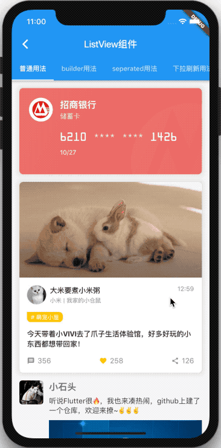
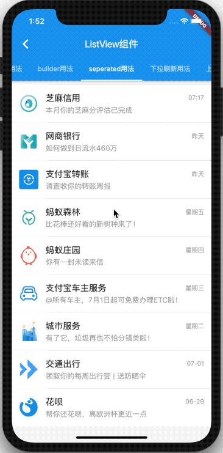
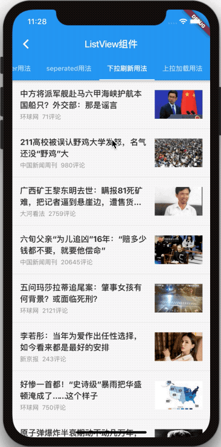
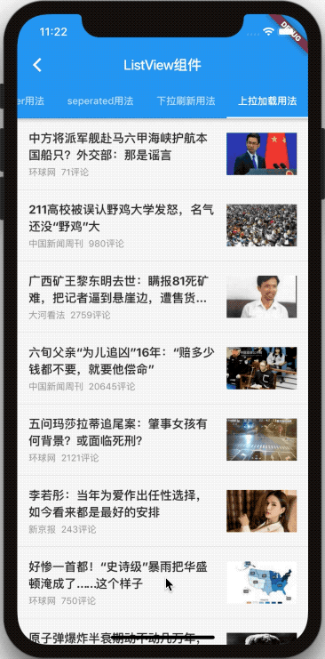

# ListView列表组件 - 示例

|1. [普通列表](./normal_usage.dart)|2. [公众号列表](./builder_usage.dart)|3. [支付宝好友列表](./separated_usage.dart)|
|----|---|---|
||||

|4. [下拉刷新](./pull_down_refresh_usage.dart)|5. [上拉加载](./pull_up_load_more_usage.dart)|
|----|---|
|||