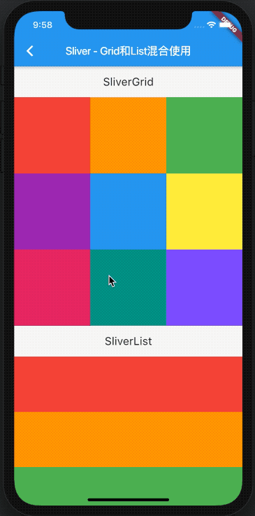
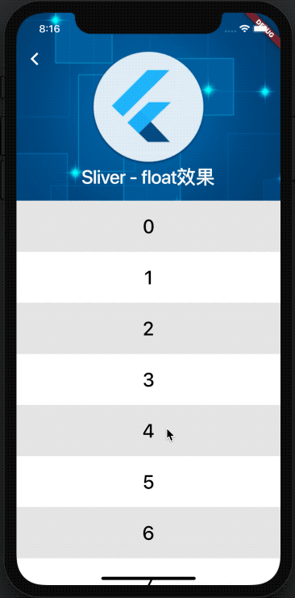
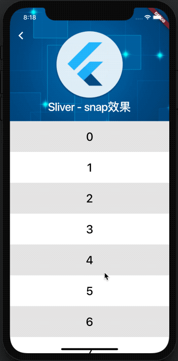
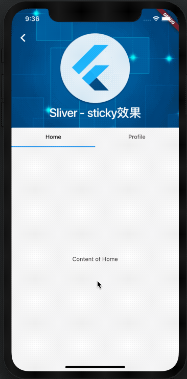
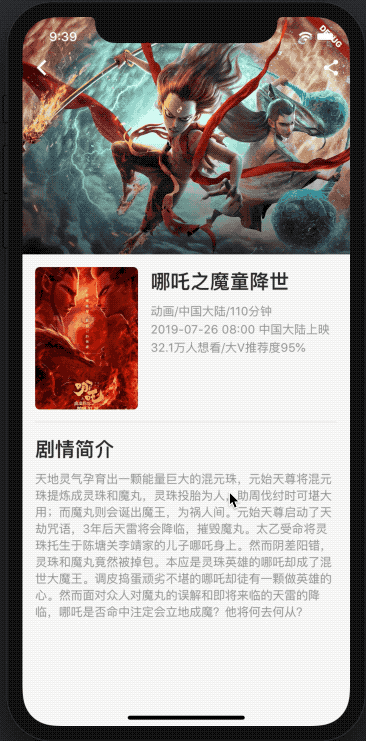

# CustomScrollView和Sliver系列 - 示例

|1. [SliverList和SliverGrid](./basic_usage.dart)|2. [SliverAppBar float效果](./float_usage.dart)|3. [SliverAppBar snap效果](./snap_usage.dart)|
|----|---|---|
||||

|4. [SliverAppBar pinned效果](./pinned_usage.dart)|5. [sticky吸顶效果](./sticky_usage.dart)|6. [自定义头部](./custom_sliver_header_usage.dart)|
|----|---|---|
||||